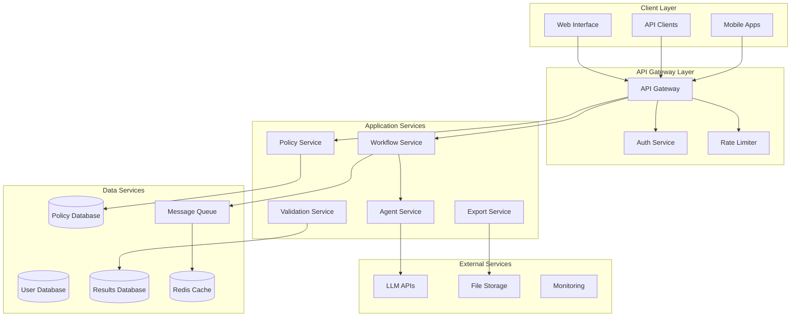

# Backend Deployment Architecture - Secure Enterprise Deployment

## 🏗️ Production Architecture Overview

### Current State vs. Production Requirements

**Current (Demo/Development):**
- Single-machine deployment
- File-based storage
- Direct API calls
- Basic error handling
- Streamlit web interface

**Production (Enterprise-Ready):**
- Microservices architecture
- Database persistence
- API gateway with authentication
- Advanced security and compliance
- Scalable cloud infrastructure

---

## 🔐 Security Requirements

### 1. Data Protection & Privacy

**Data Classification:**
- **Highly Sensitive:** Immigration policy documents, personal applicant data
- **Sensitive:** Generated requirements, application questions
- **Internal:** System logs, performance metrics

**Security Measures Required:**
```yaml
Encryption:
  - Data at Rest: AES-256 encryption
  - Data in Transit: TLS 1.3
  - Database: Transparent Data Encryption (TDE)
  - API Communications: End-to-end encryption

Access Control:
  - Multi-factor Authentication (MFA)
  - Role-Based Access Control (RBAC)
  - Principle of Least Privilege
  - Regular access reviews and rotation

Data Handling:
  - Data residency compliance (GDPR, SOC2)
  - Automatic data purging policies
  - Audit logging for all data access
  - Data anonymization for analytics
```

### 2. Authentication & Authorization

**Identity Management:**
```yaml
Authentication:
  - SAML 2.0 / OAuth 2.0 / OpenID Connect
  - Integration with enterprise identity providers
  - API key management with rotation
  - Session management with timeout policies

Authorization:
  - JWT tokens with short expiration
  - Granular permissions system
  - Resource-level access control
  - API rate limiting per user/organization
```

### 3. Network Security

**Infrastructure Security:**
```yaml
Network Isolation:
  - Virtual Private Cloud (VPC)
  - Private subnets for backend services
  - Network Access Control Lists (NACLs)
  - Security groups with minimal access

Traffic Management:
  - Web Application Firewall (WAF)
  - DDoS protection
  - Load balancers with SSL termination
  - API gateway with throttling
```

---

## 🏛️ Microservices Architecture

### Core Services Architecture



### 1. API Gateway Service

**Technology:** Kong, AWS API Gateway, or Azure API Management

**Responsibilities:**
- Request routing and load balancing
- Authentication and authorization
- Rate limiting and throttling
- Request/response transformation
- API versioning and documentation

**Configuration:**
```yaml
api_gateway:
  authentication:
    - jwt_validation
    - api_key_validation
    - oauth2_integration
  
  rate_limiting:
    - per_user: 1000/hour
    - per_organization: 10000/hour
    - burst_limit: 100/minute
  
  security:
    - cors_policy
    - csrf_protection
    - request_size_limits
```

### 2. Policy Management Service

**Technology:** FastAPI + PostgreSQL

**Responsibilities:**
- Policy document storage and versioning
- Policy metadata management
- Access control for policy documents
- Policy comparison and analysis

**Database Schema:**
```sql
-- Policy documents table
CREATE TABLE policies (
    id UUID PRIMARY KEY,
    name VARCHAR(255) NOT NULL,
    version VARCHAR(50) NOT NULL,
    content TEXT NOT NULL,
    content_hash VARCHAR(64) NOT NULL,
    organization_id UUID NOT NULL,
    created_by UUID NOT NULL,
    created_at TIMESTAMP DEFAULT NOW(),
    updated_at TIMESTAMP DEFAULT NOW(),
    status VARCHAR(50) DEFAULT 'active',
    metadata JSONB
);

-- Policy access control
CREATE TABLE policy_permissions (
    id UUID PRIMARY KEY,
    policy_id UUID REFERENCES policies(id),
    user_id UUID,
    role_id UUID,
    permissions JSONB,
    granted_at TIMESTAMP DEFAULT NOW()
);
```

### 3. Workflow Orchestration Service

**Technology:** Celery + Redis/RabbitMQ

**Responsibilities:**
- Workflow execution and monitoring
- Agent coordination and communication
- Task queuing and scheduling
- Progress tracking and notifications

**Architecture:**
```python
# Workflow service structure
class WorkflowService:
    def __init__(self):
        self.task_queue = CeleryApp()
        self.agent_registry = AgentRegistry()
        self.progress_tracker = ProgressTracker()
    
    async def execute_workflow(self, policy_id: str, user_id: str):
        workflow_id = self.create_workflow(policy_id, user_id)
        
        # Queue tasks with dependencies
        tasks = [
            self.task_queue.send_task('policy_analysis', args=[workflow_id]),
            self.task_queue.send_task('requirements_capture', args=[workflow_id]),
            self.task_queue.send_task('question_generation', args=[workflow_id]),
            self.task_queue.send_task('validation', args=[workflow_id]),
            self.task_queue.send_task('consolidation', args=[workflow_id])
        ]
        
        return workflow_id
```

### 4. Agent Management Service

**Technology:** FastAPI + Docker containers

**Responsibilities:**
- AI agent lifecycle management
- LLM API management and failover
- Result validation and quality control
- Agent performance monitoring

**Agent Isolation:**
```dockerfile
# Agent container template
FROM python:3.11-slim

# Security hardening
RUN useradd -m -u 1000 agent && \
    apt-get update && \
    apt-get install -y --no-install-recommends \
    && rm -rf /var/lib/apt/lists/*

USER agent
WORKDIR /app

COPY requirements.txt .
RUN pip install --no-cache-dir -r requirements.txt

COPY src/ ./src/
EXPOSE 8000

CMD ["uvicorn", "src.agent_service:app", "--host", "0.0.0.0", "--port", "8000"]
```

---

## 💾 Database Architecture

### 1. Primary Database (PostgreSQL)

**Configuration:**
```yaml
postgresql:
  version: "14+"
  high_availability: true
  replication: 
    - primary: 1 instance
    - read_replicas: 2 instances
  
  security:
    - ssl_mode: require
    - encryption: AES-256
    - connection_pooling: pgbouncer
    - backup_encryption: enabled
  
  performance:
    - connection_pool_size: 100
    - shared_buffers: "25% of RAM"
    - effective_cache_size: "75% of RAM"
```

**Schema Design:**
```sql
-- Organizations and users
CREATE TABLE organizations (
    id UUID PRIMARY KEY,
    name VARCHAR(255) NOT NULL,
    domain VARCHAR(255),
    settings JSONB,
    created_at TIMESTAMP DEFAULT NOW()
);

CREATE TABLE users (
    id UUID PRIMARY KEY,
    email VARCHAR(255) UNIQUE NOT NULL,
    organization_id UUID REFERENCES organizations(id),
    role VARCHAR(50) NOT NULL,
    last_login TIMESTAMP,
    created_at TIMESTAMP DEFAULT NOW()
);

-- Workflows and results
CREATE TABLE workflows (
    id UUID PRIMARY KEY,
    policy_id UUID REFERENCES policies(id),
    user_id UUID REFERENCES users(id),
    status VARCHAR(50) DEFAULT 'pending',
    started_at TIMESTAMP DEFAULT NOW(),
    completed_at TIMESTAMP,
    results JSONB,
    metadata JSONB
);

-- Audit logging
CREATE TABLE audit_logs (
    id UUID PRIMARY KEY,
    user_id UUID REFERENCES users(id),
    action VARCHAR(100) NOT NULL,
    resource_type VARCHAR(50),
    resource_id UUID,
    details JSONB,
    ip_address INET,
    user_agent TEXT,
    timestamp TIMESTAMP DEFAULT NOW()
);
```

### 2. Cache Layer (Redis)

**Configuration:**
```yaml
redis:
  deployment: cluster
  nodes: 3
  replication: enabled
  
  security:
    - auth_enabled: true
    - tls_enabled: true
    - acl_users: configured
  
  performance:
    - memory_policy: allkeys-lru
    - max_memory: "2GB per node"
    - persistence: RDB + AOF
```

**Usage Patterns:**
```python
# Cache configuration
CACHE_CONFIG = {
    'policy_cache': {
        'ttl': 3600,  # 1 hour
        'key_pattern': 'policy:{policy_id}'
    },
    'workflow_results': {
        'ttl': 86400,  # 24 hours
        'key_pattern': 'workflow:{workflow_id}:results'
    },
    'user_sessions': {
        'ttl': 1800,  # 30 minutes
        'key_pattern': 'session:{user_id}'
    }
}
```

### 3. File Storage

**Technology:** AWS S3, Azure Blob Storage, or Google Cloud Storage

**Configuration:**
```yaml
object_storage:
  encryption:
    - server_side: AES-256
    - client_side: enabled
    - key_management: AWS KMS / Azure Key Vault
  
  access_control:
    - bucket_policies: restrictive
    - signed_urls: temporary access
    - versioning: enabled
    - lifecycle_policies: configured
  
  backup:
    - cross_region_replication: enabled
    - point_in_time_recovery: 30 days
    - automated_backups: daily
```

---

## 🚀 Deployment Infrastructure

### 1. Container Orchestration (Kubernetes)

**Cluster Configuration:**
```yaml
# kubernetes-cluster.yaml
apiVersion: v1
kind: Namespace
metadata:
  name: visa-agent-prod

---
apiVersion: apps/v1
kind: Deployment
metadata:
  name: policy-service
  namespace: visa-agent-prod
spec:
  replicas: 3
  selector:
    matchLabels:
      app: policy-service
  template:
    metadata:
      labels:
        app: policy-service
    spec:
      securityContext:
        runAsNonRoot: true
        runAsUser: 1000
        fsGroup: 1000
      containers:
      - name: policy-service
        image: visa-agent/policy-service:latest
        ports:
        - containerPort: 8000
        env:
        - name: DATABASE_URL
          valueFrom:
            secretKeyRef:
              name: db-credentials
              key: url
        resources:
          requests:
            memory: "512Mi"
            cpu: "250m"
          limits:
            memory: "1Gi"
            cpu: "500m"
        livenessProbe:
          httpGet:
            path: /health
            port: 8000
          initialDelaySeconds: 30
          periodSeconds: 10
        readinessProbe:
          httpGet:
            path: /ready
            port: 8000
          initialDelaySeconds: 5
          periodSeconds: 5
```

### 2. Infrastructure as Code (Terraform)

**AWS Deployment Example:**
```hcl
# main.tf
provider "aws" {
  region = var.aws_region
}

# VPC and networking
module "vpc" {
  source = "terraform-aws-modules/vpc/aws"
  
  name = "visa-agent-vpc"
  cidr = "10.0.0.0/16"
  
  azs             = ["${var.aws_region}a", "${var.aws_region}b", "${var.aws_region}c"]
  private_subnets = ["10.0.1.0/24", "10.0.2.0/24", "10.0.3.0/24"]
  public_subnets  = ["10.0.101.0/24", "10.0.102.0/24", "10.0.103.0/24"]
  
  enable_nat_gateway = true
  enable_vpn_gateway = true
  
  tags = {
    Environment = "production"
    Project     = "visa-agent"
  }
}

# EKS cluster
module "eks" {
  source = "terraform-aws-modules/eks/aws"
  
  cluster_name    = "visa-agent-cluster"
  cluster_version = "1.27"
  
  vpc_id     = module.vpc.vpc_id
  subnet_ids = module.vpc.private_subnets
  
  node_groups = {
    main = {
      desired_capacity = 3
      max_capacity     = 10
      min_capacity     = 3
      
      instance_types = ["t3.medium"]
      
      k8s_labels = {
        Environment = "production"
        Application = "visa-agent"
      }
    }
  }
}

# RDS PostgreSQL
resource "aws_db_instance" "main" {
  identifier = "visa-agent-db"
  
  engine         = "postgres"
  engine_version = "14.9"
  instance_class = "db.t3.medium"
  
  allocated_storage     = 100
  max_allocated_storage = 1000
  storage_encrypted     = true
  
  db_name  = "visaagent"
  username = var.db_username
  password = var.db_password
  
  vpc_security_group_ids = [aws_security_group.rds.id]
  db_subnet_group_name   = aws_db_subnet_group.main.name
  
  backup_retention_period = 30
  backup_window          = "03:00-04:00"
  maintenance_window     = "sun:04:00-sun:05:00"
  
  deletion_protection = true
  skip_final_snapshot = false
  
  tags = {
    Environment = "production"
    Project     = "visa-agent"
  }
}

# ElastiCache Redis
resource "aws_elasticache_replication_group" "main" {
  replication_group_id       = "visa-agent-redis"
  description                = "Redis cluster for visa agent"
  
  node_type                  = "cache.t3.micro"
  port                       = 6379
  parameter_group_name       = "default.redis7"
  
  num_cache_clusters         = 3
  automatic_failover_enabled = true
  multi_az_enabled          = true
  
  subnet_group_name = aws_elasticache_subnet_group.main.name
  security_group_ids = [aws_security_group.redis.id]
  
  at_rest_encryption_enabled = true
  transit_encryption_enabled = true
  
  tags = {
    Environment = "production"
    Project     = "visa-agent"
  }
}
```

### 3. CI/CD Pipeline

**GitHub Actions Example:**
```yaml
# .github/workflows/deploy.yml
name: Deploy to Production

on:
  push:
    branches: [main]

jobs:
  security-scan:
    runs-on: ubuntu-latest
    steps:
    - uses: actions/checkout@v3
    - name: Run security scan
      uses: securecodewarrior/github-action-add-sarif@v1
      with:
        sarif-file: security-scan-results.sarif
    
    - name: Dependency vulnerability scan
      run: |
        pip install safety
        safety check -r requirements.txt

  build-and-test:
    runs-on: ubuntu-latest
    needs: security-scan
    steps:
    - uses: actions/checkout@v3
    
    - name: Build Docker images
      run: |
        docker build -t visa-agent/policy-service:${{ github.sha }} ./services/policy
        docker build -t visa-agent/workflow-service:${{ github.sha }} ./services/workflow
    
    - name: Run tests
      run: |
        docker-compose -f docker-compose.test.yml up --abort-on-container-exit
    
    - name: Push to registry
      run: |
        echo ${{ secrets.DOCKER_PASSWORD }} | docker login -u ${{ secrets.DOCKER_USERNAME }} --password-stdin
        docker push visa-agent/policy-service:${{ github.sha }}
        docker push visa-agent/workflow-service:${{ github.sha }}

  deploy:
    runs-on: ubuntu-latest
    needs: build-and-test
    steps:
    - name: Deploy to Kubernetes
      run: |
        kubectl set image deployment/policy-service policy-service=visa-agent/policy-service:${{ github.sha }}
        kubectl set image deployment/workflow-service workflow-service=visa-agent/workflow-service:${{ github.sha }}
        kubectl rollout status deployment/policy-service
        kubectl rollout status deployment/workflow-service
```

---

## 📊 Monitoring & Observability

### 1. Application Monitoring

**Technology Stack:**
- **Metrics:** Prometheus + Grafana
- **Logging:** ELK Stack (Elasticsearch, Logstash, Kibana)
- **Tracing:** Jaeger or Zipkin
- **APM:** New Relic or Datadog

**Key Metrics:**
```yaml
application_metrics:
  performance:
    - workflow_execution_time
    - agent_response_time
    - api_response_time
    - database_query_time
  
  business:
    - workflows_completed_per_hour
    - success_rate_by_agent
    - user_satisfaction_scores
    - policy_processing_accuracy
  
  infrastructure:
    - cpu_utilization
    - memory_usage
    - disk_io
    - network_latency
```

### 2. Security Monitoring

**SIEM Integration:**
```yaml
security_monitoring:
  log_sources:
    - application_logs
    - api_gateway_logs
    - database_audit_logs
    - infrastructure_logs
  
  alerts:
    - failed_authentication_attempts
    - unusual_api_usage_patterns
    - data_access_anomalies
    - privilege_escalation_attempts
  
  compliance:
    - gdpr_data_processing_logs
    - soc2_audit_trails
    - access_review_reports
```

### 3. Health Checks & Alerting

**Health Check Endpoints:**
```python
# Health check implementation
from fastapi import FastAPI, status
from fastapi.responses import JSONResponse

app = FastAPI()

@app.get("/health")
async def health_check():
    """Basic health check"""
    return {"status": "healthy", "timestamp": datetime.utcnow()}

@app.get("/ready")
async def readiness_check():
    """Readiness check with dependencies"""
    checks = {
        "database": await check_database_connection(),
        "redis": await check_redis_connection(),
        "llm_api": await check_llm_api_availability()
    }
    
    if all(checks.values()):
        return JSONResponse(
            content={"status": "ready", "checks": checks},
            status_code=status.HTTP_200_OK
        )
    else:
        return JSONResponse(
            content={"status": "not_ready", "checks": checks},
            status_code=status.HTTP_503_SERVICE_UNAVAILABLE
        )
```

---

## 🔒 Compliance & Governance

### 1. Data Governance

**Data Classification:**
```yaml
data_classification:
  public:
    - system_documentation
    - api_specifications
  
  internal:
    - system_metrics
    - performance_logs
  
  confidential:
    - user_data
    - policy_documents
  
  restricted:
    - authentication_credentials
    - encryption_keys
    - personal_identifiable_information
```

**Data Retention Policies:**
```yaml
retention_policies:
  user_data:
    retention_period: "7 years"
    deletion_method: "secure_wipe"
  
  audit_logs:
    retention_period: "10 years"
    archival_method: "encrypted_cold_storage"
  
  workflow_results:
    retention_period: "5 years"
    anonymization_after: "2 years"
```

### 2. Compliance Frameworks

**SOC 2 Type II:**
- Access controls and user management
- System availability and performance monitoring
- Data processing integrity controls
- Confidentiality of customer data
- Privacy protection measures

**GDPR Compliance:**
- Data processing lawfulness documentation
- Data subject rights implementation
- Privacy by design architecture
- Data breach notification procedures
- Data protection impact assessments

**ISO 27001:**
- Information security management system
- Risk assessment and treatment
- Security controls implementation
- Continuous monitoring and improvement

---

## 💰 Cost Optimization

### 1. Infrastructure Costs

**Estimated Monthly Costs (AWS):**
```yaml
infrastructure_costs:
  compute:
    - eks_cluster: $150/month
    - worker_nodes: $300/month (3 x t3.medium)
    - auto_scaling: $0-500/month (based on load)
  
  database:
    - rds_postgresql: $200/month (db.t3.medium)
    - redis_cluster: $100/month (3 x cache.t3.micro)
  
  storage:
    - s3_storage: $50/month (1TB)
    - ebs_volumes: $100/month
  
  networking:
    - load_balancer: $25/month
    - data_transfer: $50/month
  
  monitoring:
    - cloudwatch: $50/month
    - third_party_apm: $200/month
  
  total_estimated: $1,225/month
```

### 2. Cost Optimization Strategies

**Resource Optimization:**
- Auto-scaling based on demand
- Spot instances for non-critical workloads
- Reserved instances for predictable workloads
- Resource right-sizing based on metrics

**Operational Efficiency:**
- Automated deployment and scaling
- Efficient caching strategies
- Database query optimization
- API response optimization

---

## 🚀 Deployment Checklist

### Pre-Production Checklist

**Security:**
- [ ] Security scan completed and vulnerabilities addressed
- [ ] Penetration testing performed
- [ ] SSL/TLS certificates configured
- [ ] Secrets management implemented
- [ ] Access controls configured and tested

**Performance:**
- [ ] Load testing completed
- [ ] Database performance optimized
- [ ] Caching strategy implemented
- [ ] CDN configured for static assets
- [ ] Auto-scaling policies configured

**Monitoring:**
- [ ] Application monitoring configured
- [ ] Infrastructure monitoring set up
- [ ] Log aggregation implemented
- [ ] Alerting rules configured
- [ ] Health checks implemented

**Compliance:**
- [ ] Data governance policies implemented
- [ ] Audit logging configured
- [ ] Backup and recovery procedures tested
- [ ] Disaster recovery plan documented
- [ ] Compliance requirements validated

**Operations:**
- [ ] CI/CD pipeline configured
- [ ] Documentation completed
- [ ] Runbooks created
- [ ] Team training completed
- [ ] Support procedures established

---

This comprehensive backend architecture provides enterprise-grade security, scalability, and compliance for the Visa Requirements Agent system, ready for production deployment in government and enterprise environments.
